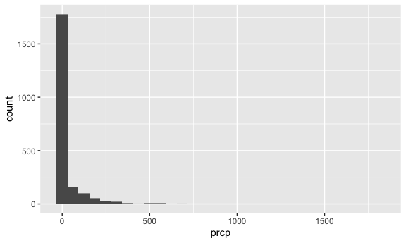
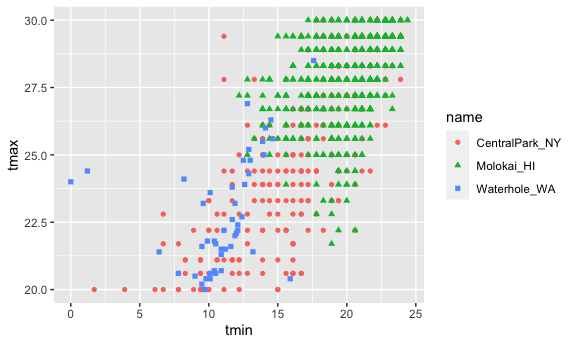
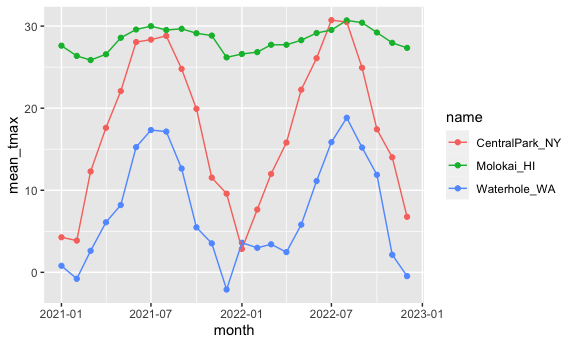
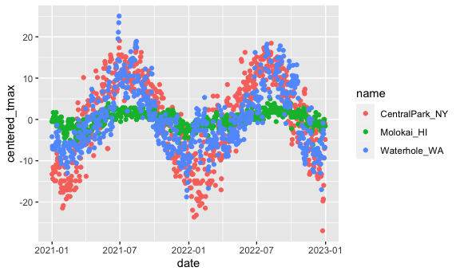

exploratory data analysis: numeric summaries
================
Shihui Peng
2023-10-12

``` r
library(tidyverse)

knitr::opts_chunk$set(
  fig.width = 6,
  fig.asp = .6,
  out.width = "90%"
)
```

# Get the data for plotting

``` r
weather_df = 
  rnoaa::meteo_pull_monitors(
    c("USW00094728", "USW00022534", "USS0023B17S"),
    var = c("PRCP", "TMIN", "TMAX"), 
    date_min = "2021-01-01",
    date_max = "2022-12-31") |>
  mutate(
    name = recode(
      id, 
      USW00094728 = "CentralPark_NY", 
      USW00022534 = "Molokai_HI",
      USS0023B17S = "Waterhole_WA"),
    tmin = tmin / 10,
    tmax = tmax / 10,
    month = lubridate::floor_date(date, unit = 'month')) |>
  select(name, id, everything())
```

    ## using cached file: /Users/peng_/Library/Caches/org.R-project.R/R/rnoaa/noaa_ghcnd/USW00094728.dly

    ## date created (size, mb): 2023-10-12 05:40:09.606797 (8.534)

    ## file min/max dates: 1869-01-01 / 2023-10-31

    ## using cached file: /Users/peng_/Library/Caches/org.R-project.R/R/rnoaa/noaa_ghcnd/USW00022534.dly

    ## date created (size, mb): 2023-10-12 05:40:14.620904 (3.839)

    ## file min/max dates: 1949-10-01 / 2023-10-31

    ## using cached file: /Users/peng_/Library/Caches/org.R-project.R/R/rnoaa/noaa_ghcnd/USS0023B17S.dly

    ## date created (size, mb): 2023-10-12 05:40:16.392605 (0.997)

    ## file min/max dates: 1999-09-01 / 2023-10-31

- `month = lubridate::floor_date(data, unit = 'month')`: we use
  `floor_date()` in `lubridate` package to round down date and time
  values to a specified unit of time, such as days, months, or years.
  This function is particularly useful when you want to align dates and
  times to a common reference point or granularity. Here, recode the
  date var by month unit (eg. Jan 20 -\> Jan 01).

## initial numeric work

``` r
weather_df |> 
  ggplot(aes(x = prcp)) +
  geom_histogram()
```

    ## `stat_bin()` using `bins = 30`. Pick better value with `binwidth`.

    ## Warning: Removed 15 rows containing non-finite values (`stat_bin()`).



This is clearly a very skewed distribution; any formal analyses
involving precipitation as a predictor or outcome might be influenced by
this fact. It’s important to note that the vast majority of days have no
precipitation. Meanwhile, examining the relatively few days have very
high precipitation might be helpful.

here are the big outliers:

``` r
weather_df |> 
  filter(prcp >= 1000)
```

    ## # A tibble: 3 × 7
    ##   name           id          date        prcp  tmax  tmin month     
    ##   <chr>          <chr>       <date>     <dbl> <dbl> <dbl> <date>    
    ## 1 CentralPark_NY USW00094728 2021-08-21  1130  27.8  22.8 2021-08-01
    ## 2 CentralPark_NY USW00094728 2021-09-01  1811  25.6  17.2 2021-09-01
    ## 3 Molokai_HI     USW00022534 2022-12-18  1120  23.3  18.9 2022-12-01

it shows 3 outliers. when meeting outlier, check our ds and bg to
understand why they happened.

``` r
weather_df |> 
  filter(tmax >= 20, tmax <= 30) |> 
  ggplot(aes(x = tmin, y = tmax, color = name, shape = name)) +
  geom_point()
```



Strange plots – We can tell from the plot that maybe Molokai use diff
monitor tyoe or maybe it use Fahrenheit while Waterhole use Celsius
degree, etc.

- Thus, we should do stuff like above to notice these numeric feature
  before doing anything analytical.

## Grouping w `group_by()`

``` r
weather_df |> 
  group_by(name, month)
```

    ## # A tibble: 2,190 × 7
    ## # Groups:   name, month [72]
    ##    name           id          date        prcp  tmax  tmin month     
    ##    <chr>          <chr>       <date>     <dbl> <dbl> <dbl> <date>    
    ##  1 CentralPark_NY USW00094728 2021-01-01   157   4.4   0.6 2021-01-01
    ##  2 CentralPark_NY USW00094728 2021-01-02    13  10.6   2.2 2021-01-01
    ##  3 CentralPark_NY USW00094728 2021-01-03    56   3.3   1.1 2021-01-01
    ##  4 CentralPark_NY USW00094728 2021-01-04     5   6.1   1.7 2021-01-01
    ##  5 CentralPark_NY USW00094728 2021-01-05     0   5.6   2.2 2021-01-01
    ##  6 CentralPark_NY USW00094728 2021-01-06     0   5     1.1 2021-01-01
    ##  7 CentralPark_NY USW00094728 2021-01-07     0   5    -1   2021-01-01
    ##  8 CentralPark_NY USW00094728 2021-01-08     0   2.8  -2.7 2021-01-01
    ##  9 CentralPark_NY USW00094728 2021-01-09     0   2.8  -4.3 2021-01-01
    ## 10 CentralPark_NY USW00094728 2021-01-10     0   5    -1.6 2021-01-01
    ## # ℹ 2,180 more rows

- `group_by(name, month)`: group by name var and month var. this is
  invisible, and easy to be forgotten.
- Because these (and other) functions will use grouping information if
  it exists, it is sometimes necessary to remove groups using
  `ungroup()`.

## Counting w `summarise()`

``` r
weather_df |> 
  group_by(name, month) |> 
  summarise(n_obs = n())
```

    ## `summarise()` has grouped output by 'name'. You can override using the
    ## `.groups` argument.

    ## # A tibble: 72 × 3
    ## # Groups:   name [3]
    ##    name           month      n_obs
    ##    <chr>          <date>     <int>
    ##  1 CentralPark_NY 2021-01-01    31
    ##  2 CentralPark_NY 2021-02-01    28
    ##  3 CentralPark_NY 2021-03-01    31
    ##  4 CentralPark_NY 2021-04-01    30
    ##  5 CentralPark_NY 2021-05-01    31
    ##  6 CentralPark_NY 2021-06-01    30
    ##  7 CentralPark_NY 2021-07-01    31
    ##  8 CentralPark_NY 2021-08-01    31
    ##  9 CentralPark_NY 2021-09-01    30
    ## 10 CentralPark_NY 2021-10-01    31
    ## # ℹ 62 more rows

``` r
weather_df |>
  group_by(month) |>
  summarize(
    n_obs = n(),
    n_days = n_distinct(date))
```

    ## # A tibble: 24 × 3
    ##    month      n_obs n_days
    ##    <date>     <int>  <int>
    ##  1 2021-01-01    93     31
    ##  2 2021-02-01    84     28
    ##  3 2021-03-01    93     31
    ##  4 2021-04-01    90     30
    ##  5 2021-05-01    93     31
    ##  6 2021-06-01    90     30
    ##  7 2021-07-01    93     31
    ##  8 2021-08-01    93     31
    ##  9 2021-09-01    90     30
    ## 10 2021-10-01    93     31
    ## # ℹ 14 more rows

- 1st query
  - `summarise(n_obs = n())` let r to count how many observations. since
    we use `group_by()` before, it will count by the group we just
    define.
- 2nd query
  - we can use summarize() to compute multiple summaries within each
    group. As an example, we count the number of observations in each
    month and the number of distinct/unique values of date in each month
    (`n_distinct(date)`).

``` r
weather_df |> 
  count(name, name = 'n_obs')
```

    ## # A tibble: 3 × 2
    ##   name           n_obs
    ##   <chr>          <int>
    ## 1 CentralPark_NY   730
    ## 2 Molokai_HI       730
    ## 3 Waterhole_WA     730

- This is a less handy way to count compared to `group_by()`. similar to
  group_by(name), but less efficient.
- `count()` is a useful tidyverse alternative to Base R’s table
  function. count() produces a dataframe you can use or manipulate
  directly.

## 2x2 table

You might find yourself, someday, wanting to tabulate the frequency of a
binary outcome across levels of a binary predictor. let’s say you want
to look at the number of cold and not-cold days in Central Park and
Waterhole.

``` r
weather_df |> 
  drop_na(tmax) |> 
  mutate(
    cold = case_when(
      tmax <  5 ~ "cold",
      tmax >= 5 ~ "not_cold",
      TRUE      ~ ""
  )) |> 
  filter(name != "Molokai_HI") |> 
  group_by(name, cold) |> 
  summarize(count = n())
```

    ## `summarise()` has grouped output by 'name'. You can override using the
    ## `.groups` argument.

    ## # A tibble: 4 × 3
    ## # Groups:   name [2]
    ##   name           cold     count
    ##   <chr>          <chr>    <int>
    ## 1 CentralPark_NY cold        96
    ## 2 CentralPark_NY not_cold   634
    ## 3 Waterhole_WA   cold       319
    ## 4 Waterhole_WA   not_cold   395

This is a “tidy” table, and it’s also a data frame.

You could re-organize into a more standard (non-tidy) 2x2 table using
pivot_wider, or you could use `janitor::tabyl`:

``` r
weather_df |> 
  drop_na(tmax) |> 
  mutate(cold = case_when(
    tmax <  5 ~ "cold",
    tmax >= 5 ~ "not_cold",
    TRUE     ~ ""
  )) |> 
  filter(name != "Molokai_HI") |> 
  janitor::tabyl(name, cold)
```

    ##            name cold not_cold
    ##  CentralPark_NY   96      634
    ##    Waterhole_WA  319      395

- `TRUE     ~ ""`: If neither of the above conditions is met (i.e., when
  tmax is neither less than 5 nor greater than or equal to 5), the cold
  column is set to an empty string (““), effectively marking it as
  blank.

``` r
weather_df |> 
  count(name, month) |> 
  pivot_wider(
    names_from = name,
    values_from = n
  )
```

    ## # A tibble: 24 × 4
    ##    month      CentralPark_NY Molokai_HI Waterhole_WA
    ##    <date>              <int>      <int>        <int>
    ##  1 2021-01-01             31         31           31
    ##  2 2021-02-01             28         28           28
    ##  3 2021-03-01             31         31           31
    ##  4 2021-04-01             30         30           30
    ##  5 2021-05-01             31         31           31
    ##  6 2021-06-01             30         30           30
    ##  7 2021-07-01             31         31           31
    ##  8 2021-08-01             31         31           31
    ##  9 2021-09-01             30         30           30
    ## 10 2021-10-01             31         31           31
    ## # ℹ 14 more rows

- transfer to untidy ds to make it readable w `pivot_wider`.

## General summarises

``` r
weather_df |> 
  group_by(name, month) |> 
  summarise(
    mean_tmax = mean(tmax, na.rm = TRUE),
    median_tmax = median(tmax, na.rm = TRUE),
    std_tmax = sd(tmax, na.rm = TRUE),
  ) 
```

    ## `summarise()` has grouped output by 'name'. You can override using the
    ## `.groups` argument.

    ## # A tibble: 72 × 5
    ## # Groups:   name [3]
    ##    name           month      mean_tmax median_tmax std_tmax
    ##    <chr>          <date>         <dbl>       <dbl>    <dbl>
    ##  1 CentralPark_NY 2021-01-01      4.27         5       3.34
    ##  2 CentralPark_NY 2021-02-01      3.87         2.8     3.99
    ##  3 CentralPark_NY 2021-03-01     12.3         12.2     6.91
    ##  4 CentralPark_NY 2021-04-01     17.6         18.0     5.26
    ##  5 CentralPark_NY 2021-05-01     22.1         22.2     5.63
    ##  6 CentralPark_NY 2021-06-01     28.1         27.8     4.32
    ##  7 CentralPark_NY 2021-07-01     28.4         28.3     3.17
    ##  8 CentralPark_NY 2021-08-01     28.8         28.3     2.95
    ##  9 CentralPark_NY 2021-09-01     24.8         24.4     2.52
    ## 10 CentralPark_NY 2021-10-01     19.9         20.6     3.66
    ## # ℹ 62 more rows

``` r
weather_df |>
  group_by(name, month) |>
  summarize(across(tmin:prcp, mean))
```

    ## `summarise()` has grouped output by 'name'. You can override using the
    ## `.groups` argument.

    ## # A tibble: 72 × 5
    ## # Groups:   name [3]
    ##    name           month       tmin  tmax  prcp
    ##    <chr>          <date>     <dbl> <dbl> <dbl>
    ##  1 CentralPark_NY 2021-01-01 -1.15  4.27  18.9
    ##  2 CentralPark_NY 2021-02-01 -1.39  3.87  46.6
    ##  3 CentralPark_NY 2021-03-01  3.1  12.3   28.0
    ##  4 CentralPark_NY 2021-04-01  7.48 17.6   22.8
    ##  5 CentralPark_NY 2021-05-01 12.2  22.1   35.7
    ##  6 CentralPark_NY 2021-06-01 18.9  28.1   22.2
    ##  7 CentralPark_NY 2021-07-01 20.6  28.4   90.9
    ##  8 CentralPark_NY 2021-08-01 21.8  28.8   84.5
    ##  9 CentralPark_NY 2021-09-01 17.8  24.8   84.9
    ## 10 CentralPark_NY 2021-10-01 13.4  19.9   43.1
    ## # ℹ 62 more rows

- NA will be displayed in mean_tmax if we don’t drop NA. we can solve in
  2 ways:
  - `drop_na(tmax)`
  - put `na.rm = TRUE` inside `mean()` to remove NA. here, the default
    is FALSE
- `sd()` for standard deviation, `median()` for median, `mean()` for
  mean.
- If you want to summarize multiple columns using the same summary, the
  `across` function is helpful.

``` r
weather_df |> 
  group_by(name, month) |> 
  summarise(mean_tmax = mean(tmax, na.rm = TRUE)) |> 
  ggplot(aes(x = month, y = mean_tmax, color = name)) +
  geom_point() +
  geom_line()
```

    ## `summarise()` has grouped output by 'name'. You can override using the
    ## `.groups` argument.



Here i get a plot which i visually in right structure. But if I want to
export this table and help ppl feel easy to read, i will use
`pivot_wider()` to do it:

``` r
weather_df |> 
  group_by(name, month) |> 
  summarise(mean_tmax = mean(tmax, na.rm = TRUE)) |> 
  pivot_wider(
    names_from = name,
    values_from = mean_tmax
  ) |> 
  knitr::kable(digits = 2)
```

    ## `summarise()` has grouped output by 'name'. You can override using the
    ## `.groups` argument.

| month      | CentralPark_NY | Molokai_HI | Waterhole_WA |
|:-----------|---------------:|-----------:|-------------:|
| 2021-01-01 |           4.27 |      27.62 |         0.80 |
| 2021-02-01 |           3.87 |      26.37 |        -0.79 |
| 2021-03-01 |          12.29 |      25.86 |         2.62 |
| 2021-04-01 |          17.61 |      26.57 |         6.10 |
| 2021-05-01 |          22.08 |      28.58 |         8.20 |
| 2021-06-01 |          28.06 |      29.59 |        15.25 |
| 2021-07-01 |          28.35 |      29.99 |        17.34 |
| 2021-08-01 |          28.81 |      29.52 |        17.15 |
| 2021-09-01 |          24.79 |      29.67 |        12.65 |
| 2021-10-01 |          19.93 |      29.13 |         5.48 |
| 2021-11-01 |          11.54 |      28.85 |         3.53 |
| 2021-12-01 |           9.59 |      26.19 |        -2.10 |
| 2022-01-01 |           2.85 |      26.61 |         3.61 |
| 2022-02-01 |           7.65 |      26.83 |         2.99 |
| 2022-03-01 |          11.99 |      27.73 |         3.42 |
| 2022-04-01 |          15.81 |      27.72 |         2.46 |
| 2022-05-01 |          22.25 |      28.28 |         5.81 |
| 2022-06-01 |          26.09 |      29.16 |        11.13 |
| 2022-07-01 |          30.72 |      29.53 |        15.86 |
| 2022-08-01 |          30.50 |      30.70 |        18.83 |
| 2022-09-01 |          24.92 |      30.41 |        15.21 |
| 2022-10-01 |          17.43 |      29.22 |        11.88 |
| 2022-11-01 |          14.02 |      27.96 |         2.14 |
| 2022-12-01 |           6.76 |      27.35 |        -0.46 |

- The results of group_by() and summarize() are generally tidy, but
  presenting reader-friendly results for this kind of exploratory
  analysis often benefits from some un-tidying. For example, the table
  below shows month-by-month average max temperatures in a more
  human-readable format.
- `knitr::kable()`: can structure the df. so in rmd, it will show a well
  format table

## Grouped mutate

``` r
weather_df |> 
  group_by(name) |> 
  mutate(
    mean_tmax = mean(tmax, na.rm = TRUE),
    centered_tmax = tmax - mean_tmax
         ) |> 
  ggplot(aes(x = date, y = centered_tmax, color = name)) +
  geom_point()
```

    ## Warning: Removed 17 rows containing missing values (`geom_point()`).



Since i subtracted weather station specific mean from 3 weather
station’s tmax, the plot shows data hovering right around 0 in their
respective setting.

## Windows function

The previous example used `mean()` to compute the mean **within each
group**, which was then subtracted from the observed max temperature.
*`mean()` takes n inputs and produces a single output*.

Window functions, in contrast, *take n inputs and return n outputs*, and
the outputs depend on all the inputs. There are several categories of
window functions; you’re most likely to need *ranking functions and
offsets*, which we illustrate below.

### ranking things or put them into numeric order to find ~est record.

``` r
weather_df |> 
  group_by(name, month) |> 
  mutate(
    tmax_rank = min_rank(tmax)
  )
```

    ## # A tibble: 2,190 × 8
    ## # Groups:   name, month [72]
    ##    name           id          date        prcp  tmax  tmin month      tmax_rank
    ##    <chr>          <chr>       <date>     <dbl> <dbl> <dbl> <date>         <int>
    ##  1 CentralPark_NY USW00094728 2021-01-01   157   4.4   0.6 2021-01-01        14
    ##  2 CentralPark_NY USW00094728 2021-01-02    13  10.6   2.2 2021-01-01        31
    ##  3 CentralPark_NY USW00094728 2021-01-03    56   3.3   1.1 2021-01-01        13
    ##  4 CentralPark_NY USW00094728 2021-01-04     5   6.1   1.7 2021-01-01        20
    ##  5 CentralPark_NY USW00094728 2021-01-05     0   5.6   2.2 2021-01-01        19
    ##  6 CentralPark_NY USW00094728 2021-01-06     0   5     1.1 2021-01-01        16
    ##  7 CentralPark_NY USW00094728 2021-01-07     0   5    -1   2021-01-01        16
    ##  8 CentralPark_NY USW00094728 2021-01-08     0   2.8  -2.7 2021-01-01         8
    ##  9 CentralPark_NY USW00094728 2021-01-09     0   2.8  -4.3 2021-01-01         8
    ## 10 CentralPark_NY USW00094728 2021-01-10     0   5    -1.6 2021-01-01        16
    ## # ℹ 2,180 more rows

``` r
weather_df |> 
  group_by(name, month) |> 
  mutate(
    tmax_rank = min_rank(tmax)
  ) |> 
  filter(tmax_rank < 2)
```

    ## # A tibble: 92 × 8
    ## # Groups:   name, month [72]
    ##    name           id          date        prcp  tmax  tmin month      tmax_rank
    ##    <chr>          <chr>       <date>     <dbl> <dbl> <dbl> <date>         <int>
    ##  1 CentralPark_NY USW00094728 2021-01-29     0  -3.8  -9.9 2021-01-01         1
    ##  2 CentralPark_NY USW00094728 2021-02-08     0  -1.6  -8.2 2021-02-01         1
    ##  3 CentralPark_NY USW00094728 2021-03-02     0   0.6  -6   2021-03-01         1
    ##  4 CentralPark_NY USW00094728 2021-04-02     0   3.9  -2.1 2021-04-01         1
    ##  5 CentralPark_NY USW00094728 2021-05-29   117  10.6   8.3 2021-05-01         1
    ##  6 CentralPark_NY USW00094728 2021-05-30   226  10.6   8.3 2021-05-01         1
    ##  7 CentralPark_NY USW00094728 2021-06-11     0  20.6  16.7 2021-06-01         1
    ##  8 CentralPark_NY USW00094728 2021-06-12     0  20.6  16.7 2021-06-01         1
    ##  9 CentralPark_NY USW00094728 2021-07-03    86  18.9  15   2021-07-01         1
    ## 10 CentralPark_NY USW00094728 2021-08-04     0  24.4  19.4 2021-08-01         1
    ## # ℹ 82 more rows

- **`min_rank(tmax)`**: use to rank tmax var, from lowest to highest. if
  wanting in reverse order, use **`min_rank(desc(tmax))`**, then it will
  go from highest to lowest.
- we can use `filter(tmax_rank < 2)` to find the lowest (rank = 1) in
  each group.
- In both of these, we’ve skipped a `mutate()` statement that would
  create a ranking variable, and gone straight to filtering based on the
  result. (‘tmax_ranl =’ can be skipped if you don’t need ato create a
  new col for it)

### lag

Offsets, especially lags, are used to compare an observation to it’s
previous value. This is useful, for example, to find the day-by-day
change in max temperature within each station over the year, or how does
yesterday’s temp relate to today’s temp:

``` r
weather_df |> 
  group_by(name) |> 
  mutate(yesterday_tmax = lag(tmax, 3))
```

    ## # A tibble: 2,190 × 8
    ## # Groups:   name [3]
    ##    name           id      date        prcp  tmax  tmin month      yesterday_tmax
    ##    <chr>          <chr>   <date>     <dbl> <dbl> <dbl> <date>              <dbl>
    ##  1 CentralPark_NY USW000… 2021-01-01   157   4.4   0.6 2021-01-01           NA  
    ##  2 CentralPark_NY USW000… 2021-01-02    13  10.6   2.2 2021-01-01           NA  
    ##  3 CentralPark_NY USW000… 2021-01-03    56   3.3   1.1 2021-01-01           NA  
    ##  4 CentralPark_NY USW000… 2021-01-04     5   6.1   1.7 2021-01-01            4.4
    ##  5 CentralPark_NY USW000… 2021-01-05     0   5.6   2.2 2021-01-01           10.6
    ##  6 CentralPark_NY USW000… 2021-01-06     0   5     1.1 2021-01-01            3.3
    ##  7 CentralPark_NY USW000… 2021-01-07     0   5    -1   2021-01-01            6.1
    ##  8 CentralPark_NY USW000… 2021-01-08     0   2.8  -2.7 2021-01-01            5.6
    ##  9 CentralPark_NY USW000… 2021-01-09     0   2.8  -4.3 2021-01-01            5  
    ## 10 CentralPark_NY USW000… 2021-01-10     0   5    -1.6 2021-01-01            5  
    ## # ℹ 2,180 more rows

- `lag(tmax)` helps get temp of a day before. `lag(tmax, 3)` helps get
  temp of 3 days before.
- if we left out `group_by(name)`, it might mix CentralPark_NY rows with
  Molokai_HI rows for the first 3 rows of Molokai (the next value of
  name var).

``` r
weather_df |> 
  group_by(name) |> 
  mutate(temp_change = tmax - lag(tmax)) |> 
  summarise(
    sd_temp_change = sd(temp_change, na.rm = TRUE),
    max_temp_change = max(temp_change, na.rm = TRUE)
  )
```

    ## # A tibble: 3 × 3
    ##   name           sd_temp_change max_temp_change
    ##   <chr>                   <dbl>           <dbl>
    ## 1 CentralPark_NY           4.43            12.2
    ## 2 Molokai_HI               1.24             5.6
    ## 3 Waterhole_WA             3.04            11.1

This kind of variable might be used to quantify the day-by-day
variability in max temperature, or to identify the largest one-day
increase:

## limitation

`summarize()` can only be used with functions that **return a
single-number summary**. This creates a ceiling, even if it is very
high.
