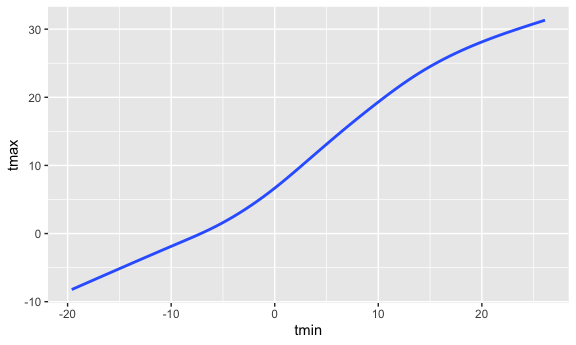
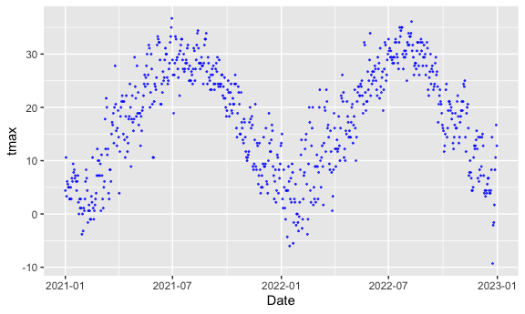
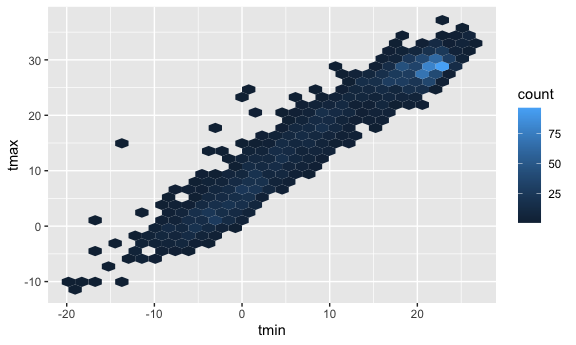
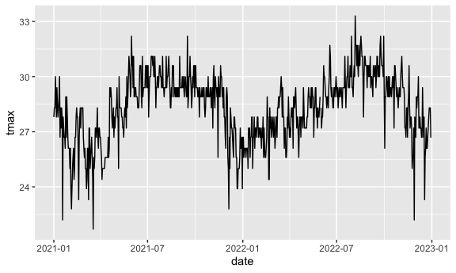
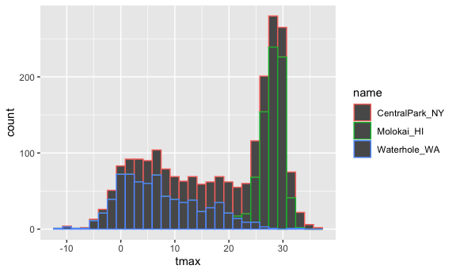
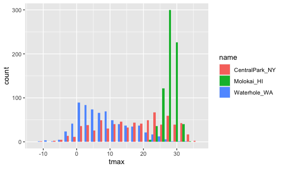
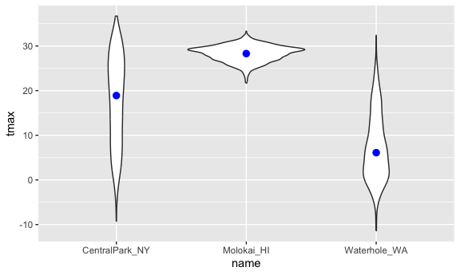
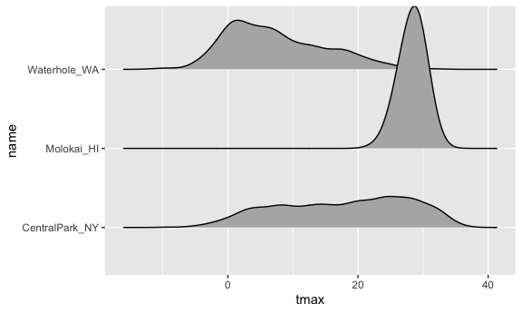

Visualization part 1
================
Shihui Peng
2023-10-12

# Get the data for plotting

``` r
weather_df = 
  rnoaa::meteo_pull_monitors(
    c("USW00094728", "USW00022534", "USS0023B17S"),
    var = c("PRCP", "TMIN", "TMAX"), 
    date_min = "2021-01-01",
    date_max = "2022-12-31") |>
  mutate(
    name = recode(
      id, 
      USW00094728 = "CentralPark_NY", 
      USW00022534 = "Molokai_HI",
      USS0023B17S = "Waterhole_WA"),
    tmin = tmin / 10,
    tmax = tmax / 10) |>
  select(name, id, everything())
```

    ## using cached file: /Users/peng_/Library/Caches/org.R-project.R/R/rnoaa/noaa_ghcnd/USW00094728.dly

    ## date created (size, mb): 2023-10-12 05:40:09.606797 (8.534)

    ## file min/max dates: 1869-01-01 / 2023-10-31

    ## using cached file: /Users/peng_/Library/Caches/org.R-project.R/R/rnoaa/noaa_ghcnd/USW00022534.dly

    ## date created (size, mb): 2023-10-12 05:40:14.620904 (3.839)

    ## file min/max dates: 1949-10-01 / 2023-10-31

    ## using cached file: /Users/peng_/Library/Caches/org.R-project.R/R/rnoaa/noaa_ghcnd/USS0023B17S.dly

    ## date created (size, mb): 2023-10-12 05:40:16.392605 (0.997)

    ## file min/max dates: 1999-09-01 / 2023-10-31

- we are using rnoaa package and function ’meteo_pull_monitors. The
  function of this agency is to monitors weather around the country and
  often around the world. There are 3 monitors to pull now:
  `"USW00094728", "USW00022534", "USS0023B17S"`, they locate in
  `"CentralPark_NY", "Molokai_HI", "Waterhole_WA"`.
- `var = c("PRCP", "TMIN", "TMAX"), date_min = "2021-01-01", date_max = "2022-12-31"`
  : give me the precipitation, the min daily temperature, and the max
  daily temperature for everyday bt 2021.1.1 and 2022.12.31.
- `mutate` part: (1) recode or create a new var that ,aps the weather
  station id into a more informative name. (2) the min and max temp come
  in 10s of degrees Celsius, divided by 10 to get better interpretation.
- `select` part: do reorganization, put name and id as the 1st and 2nd
  col, and keep everything else.
- take some time to run bc these data comes from the internet - from
  online database.

# Let’s make a plot!

``` r
ggplot(weather_df, aes(x = tmin, y = tmax)) + geom_point()
```

    ## Warning: Removed 17 rows containing missing values (`geom_point()`).

<!-- -->

- how we say to ggplot?
  - 1st: tell which dataset to be used.
  - 2nd: definie the aesthetic mappings.
    - **`aes(x = tmin, y = tmax)`**: assign variable tmin to x-axis and
      variable tmax to y-axis.
      - nothing on the plot bc haven’t said what kind of plot is to be
        made.
  - 3rd: define which graph to be used for the dataset.
    - **`geom_point()`**: **scatterplot**
- there is a warning message “Removed 17 rows containing missing values
  (`geom_point()`)”
  - across these 2 years, there are 17 days w/o tmin and tmax
    observations. these records are removed when doing the scatterplot

## Pipes and stuff

``` r
weather_df |>  
  filter(name == "CentralPark_NY") |> 
  ggplot(aes(x = tmin, y = tmax)) + geom_point()
```

<!-- -->
\* using pipes makes things easy when we want to use stuff like
`filter`. \* here we left only w the NY dataset, but we can also filter
based on year or other stuff. With pipes, we don’t need to create
additional datasets, eg. ny_df, 2021_df –\> creating too much dataset
would not be a good idea.

## Save ggplot object

``` r
ggp_nyc_weather = 
  weather_df |>  
  filter(name == "CentralPark_NY") |> 
  ggplot(aes(x = tmin, y = tmax)) + geom_point()

ggp_nyc_weather
```

<!-- -->
\* do the 1st part and then do `ggp_nyc_weather` to print and save the
plot. if we want more gems on top of this, we can also use
`ggp_nyc_weather + blablabla` to be more condense. So, save it = draw
the plot + name it

## Fancy plot

### colors, alpha blending, no SE

``` r
ggplot(weather_df, aes(x = tmin, y = tmax, color = name)) + 
  geom_point() +
  geom_smooth()
```

    ## `geom_smooth()` using method = 'loess' and formula = 'y ~ x'

    ## Warning: Removed 17 rows containing non-finite values (`stat_smooth()`).

    ## Warning: Removed 17 rows containing missing values (`geom_point()`).

<!-- -->

``` r
ggplot(weather_df, aes(x = tmin, y = tmax)) + 
  geom_point(aes(color = name, alpha = 0.3)) +
  geom_smooth()
```

    ## `geom_smooth()` using method = 'gam' and formula = 'y ~ s(x, bs = "cs")'

    ## Warning: Removed 17 rows containing non-finite values (`stat_smooth()`).
    ## Removed 17 rows containing missing values (`geom_point()`).

<!-- -->

``` r
ggplot(weather_df, aes(x = tmin, y = tmax)) +
  geom_smooth(se = FALSE)
```

    ## `geom_smooth()` using method = 'gam' and formula = 'y ~ s(x, bs = "cs")'

    ## Warning: Removed 17 rows containing non-finite values (`stat_smooth()`).

<!-- -->

- 1st query
  - **`color = name`**: for each name (a variable), use a distinct
    color.
  - **`geom_smooth()`**: it fits a smooth line in the plot w our defined
    x and y
- 2nd query
  - only 1 smooth line – we can define some aesthetics for particular
    parts of our plot
  - in 1st query, 3 smooth lines – the color aesthetic is defined
    everywhere for the plot, so is applied to all the `geom_`, so both
    scatterplot and smooth line part would be colored by name.
  - **`alpha = 0.3`**: alpha blending/shading to make plot points a bot
    transparent. ONLY in `geom_point`. alpha = 0.3 means the points are
    70% opaque and 30% solid. Then we can see everything without blocked
    by points.
- 3rd query
  - **`se = FALSE`**: get rid of the standard error bars around the
    smooth line.

### Plot with facets

if i think there are still too much stuff happen in one panel:

``` r
ggplot(weather_df, aes(x = tmin, y = tmax, color = name)) +
  geom_point(alpha = .3) +
  geom_smooth() +
  facet_grid(. ~ name)
```

    ## `geom_smooth()` using method = 'loess' and formula = 'y ~ x'

    ## Warning: Removed 17 rows containing non-finite values (`stat_smooth()`).

    ## Warning: Removed 17 rows containing missing values (`geom_point()`).

<!-- -->

``` r
ggplot(weather_df, aes(x = tmin, y = tmax, color = name)) +
  geom_point(alpha = .3) +
  geom_smooth() +
  facet_grid(name ~ .)
```

    ## `geom_smooth()` using method = 'loess' and formula = 'y ~ x'

    ## Warning: Removed 17 rows containing non-finite values (`stat_smooth()`).
    ## Removed 17 rows containing missing values (`geom_point()`).

<!-- -->
\* 1st \* **`. ~ name`**: (everything –\> the dot) facet it till
everything is in 1 row, then get separate cols according to the name
variable. (names in col) \* 2nd \* switch ‘name’ and ‘.’, then get
separate rows and 1 col (contents are the same) (names in rows) \* the
name variable would be in alphabetical order by default if we dont
define the order.

### let’s try a diff plot.

``` r
ggplot(weather_df, aes(x = date, y = tmax, color = name)) +
  geom_point(aes(size = prcp, alpha = .3)) +
  geom_smooth() +
  facet_grid(. ~ name)
```

    ## `geom_smooth()` using method = 'loess' and formula = 'y ~ x'

    ## Warning: Removed 17 rows containing non-finite values (`stat_smooth()`).

    ## Warning: Removed 19 rows containing missing values (`geom_point()`).

<!-- -->
\* **`size = prcp`**: set the size of points in the scatterplot using
precipitation variable. higher prcps will get bigger points.

### let’s try assigning a specific color

``` r
weather_df |> 
  filter(name == 'CentralPark_NY') |> 
  rename(Date = date) |> 
  ggplot(aes(x = Date, y = tmax)) +
  geom_point(color = 'blue', size = .3, alpha = .7)
```

<!-- -->
\* `color = 'blue'` need to be put inside the geom\_ where it plans to
apply to rather than being just a general ggplot option (that is, being
put inside ggplot() cannot assign specific color. inside the aes() in
the ggplot(), we take variables in the ds and map them onto colors. if
doing this, r thinks there suppose to be a var called ‘blue’ inside the
ds and then it color the points using default ggplot color.) \*
`size = .3` can be used to manually adjust point size. \* use `rename`,
we can relable the variable. but we have easy way to do this in next
class.

### hex plot w `geom_hex`

``` r
weather_df |> 
  ggplot(aes(x = tmin, y = tmax)) +
  geom_hex()
```

    ## Warning: Removed 17 rows containing non-finite values (`stat_binhex()`).

<!-- -->
\* if we have ds much larger ds, we can use **`geom_hex`** to get
something like a density plot. this is like a heat map. eg. if we have
100,000 data, putting all individual points on a plot will be a wreck.
But use geom_hex, we can see where the data exists.

### line plots

``` r
weather_df |> 
  filter(name == "Molokai_HI") |> 
  ggplot(aes(x = date, y = tmax)) +
  geom_line()
```

<!-- -->
\* doing like connect the dots, in the order of data in our ds. \* we
can use geom_point and geom_line together.

## univariate plotting

Sometime we just want to understand/look 1 variable at 1 time.

### start w histogram w `geom_histogram()`

``` r
ggplot(weather_df, aes(x = tmax, color = name)) +
  geom_histogram()
```

    ## `stat_bin()` using `bins = 30`. Pick better value with `binwidth`.

    ## Warning: Removed 17 rows containing non-finite values (`stat_bin()`).

<!-- -->

``` r
ggplot(weather_df, aes(x = tmax, fill = name)) +
  geom_histogram(position = 'dodge', binwidth = 2)
```

    ## Warning: Removed 17 rows containing non-finite values (`stat_bin()`).

<!-- -->
\* if want the color to fill in the histogram, switch `color = name` to
`fill = name` \* **`binwidth`**: define the width of the bin. \* in 1st,
histogram stacks up each other. to avoid this, use
**`position = 'dodge`** inside geom_histogram (2nd). \* but this is not
easy to understand the distribution just use histogram. so next step:

### let’s use a density plot w `geom_density()`

``` r
ggplot(weather_df, aes(x = tmax, fill = name)) +
  geom_density(alpha = 0.3, adjust = 0.5)
```

    ## Warning: Removed 17 rows containing non-finite values (`stat_density()`).

<!-- -->
\* `adjust =` is used to adjust the smoothness. The default is good, but
double check w this can be helpful sometimes.

### using boxplot w `geom_boxplot()`

``` r
ggplot(weather_df, aes(y = tmax, x = name)) +
  geom_boxplot()
```

    ## Warning: Removed 17 rows containing non-finite values (`stat_boxplot()`).

<!-- -->

### violin plot w `geom_violin()`

``` r
ggplot(weather_df, aes(y = tmax, x = name)) +
  geom_violin() +
  stat_summary(fun = 'median', color = 'blue')
```

    ## Warning: Removed 17 rows containing non-finite values (`stat_ydensity()`).

    ## Warning: Removed 17 rows containing non-finite values (`stat_summary()`).

    ## Warning: Removed 3 rows containing missing values (`geom_segment()`).

<!-- -->
\* like mirroring the density plots. provide w same info. \* but if we
get variable w lots of categories, eg. 50 names here, then difficult to
understand w density plot, and now violin plot might be useful as it
separate each cate of this variable. \*
`stat_summary(fun = 'median', color = 'blue')`: create a dot stands for
median for each violin polt, and color the dots with blue

### ridge plot w `geom_density_ridges()`

``` r
ggplot(weather_df, aes(x = tmax, y = name)) +
  geom_density_ridges()
```

    ## Picking joint bandwidth of 1.54

    ## Warning: Removed 17 rows containing non-finite values
    ## (`stat_density_ridges()`).

<!-- -->
\* create separate densities, but will stack on top of each other
vertically rather than all overlapping. useful when we have lots of cate
in a variable - easy way to understand the density of dist of a var
across lots of diff cates.
