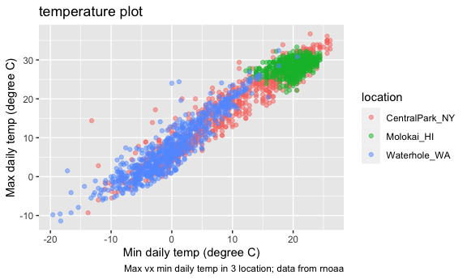

Visualization part 2
================
Shihui Peng
2023-10-12

``` r
library(tidyverse)

knitr::opts_chunk$set(
  fig.width = 6,
  fig.asp = .6,
  out.width = "90%"
)
```

# Get the data for plotting

``` r
weather_df = 
  rnoaa::meteo_pull_monitors(
    c("USW00094728", "USW00022534", "USS0023B17S"),
    var = c("PRCP", "TMIN", "TMAX"), 
    date_min = "2021-01-01",
    date_max = "2022-12-31") |>
  mutate(
    name = recode(
      id, 
      USW00094728 = "CentralPark_NY", 
      USW00022534 = "Molokai_HI",
      USS0023B17S = "Waterhole_WA"),
    tmin = tmin / 10,
    tmax = tmax / 10) |>
  select(name, id, everything())
```

    ## using cached file: /Users/peng_/Library/Caches/org.R-project.R/R/rnoaa/noaa_ghcnd/USW00094728.dly

    ## date created (size, mb): 2023-10-12 05:40:09.606797 (8.534)

    ## file min/max dates: 1869-01-01 / 2023-10-31

    ## using cached file: /Users/peng_/Library/Caches/org.R-project.R/R/rnoaa/noaa_ghcnd/USW00022534.dly

    ## date created (size, mb): 2023-10-12 05:40:14.620904 (3.839)

    ## file min/max dates: 1949-10-01 / 2023-10-31

    ## using cached file: /Users/peng_/Library/Caches/org.R-project.R/R/rnoaa/noaa_ghcnd/USS0023B17S.dly

    ## date created (size, mb): 2023-10-12 05:40:16.392605 (0.997)

    ## file min/max dates: 1999-09-01 / 2023-10-31

## labeling w `labs()`

``` r
weather_df |> 
  ggplot(aes(x = tmin, y = tmax, color = name)) +
  geom_point(alpha = .5) +
  labs(
    x = "Min daily temp (degree C)",
    y = "Max daily temp (degree C)",
    color = "location",
    title = "temperature plot",
    caption = "Max vx min daily temp in 3 location; data from rnoaa"
  )
```

    ## Warning: Removed 17 rows containing missing values (`geom_point()`).


\* **`labs()`**: label, and can label lots of aesthetics. inside the
`labs()`: \* `x =` & `y =`: label the x and y axis. \* `color =`: we
have a color aeshetics mapped onto the name var, so the name var show up
as the legend of the color bar. now, i want to label color as
‘location’. \* `title=` and `caption=` to define title and caption

## scales

we have basically 1 to 1 mapping of whatever on the aes to whatever var
that are put in. but we might want to do some tramsformation in some
association. we can start from adding diff scales to it to modify the
default mapping bt a var and the aes

``` r
weather_df |> 
  ggplot(aes(x = tmin, y = tmax, color = name)) +
  geom_point(alpha = .5) +
  labs(
    x = "Min daily temp (degree C)",
    y = "Max daily temp (degree C)",
    color = "location",
    title = "temperature plot",
    caption = "Max vx min daily temp in 3 location; data from rnoaa"
  ) +
  scale_x_continuous(
    breaks = c(-15, 0, 15),
    labels= c('-15C', '0C', '15C')
  ) +
  scale_y_continuous(
    position = 'right',
    trans = 'sqrt',
    limit = c(20, 30)
  )
```

    ## Warning in self$trans$transform(x): NaNs produced

    ## Warning: Transformation introduced infinite values in continuous y-axis

    ## Warning: Removed 1227 rows containing missing values (`geom_point()`).


- we can control over the location and specification of tick marks on
  the X or Y axis w **`scale_x_* and scale_y_*`** where \* depends on
  the type of variable mapped to the x and y aesthetics (i.e. continuous
  vs discrete).
  - **`scale_x_continuous()`**:
    - `breaks = c(-15, 0, 15)`: use this to control where things fall on
      the x-axis
    - `labels =` is to modify the labels for each point falls o the
      x-axis.
  - **`scale_y_continuous()`**:
    - `position = 'right'`: move the info of y-axis from left (default)
      to right.
    - `trans = 'sqrt'`: do a square root transformation. we can also do
      this w `mutate` before ggplot, and this can be embedded to further
      down below.
    - `limit = c(20, 30)`: limit the y-axis value wi 20~30. but
      `filter()` might be better, bc w limit=, x-axis here is not
      updated and is still the corresponding range with the previous y
      range.

## colors

``` r
weather_df |> 
  ggplot(aes(x = tmin, y = tmax, color = name)) +
  geom_point(alpha = .5) +
  labs(
    x = "Min daily temp (degree C)",
    y = "Max daily temp (degree C)",
    color = "location",
    title = "temperature plot",
    caption = "Max vx min daily temp in 3 location; data from rnoaa"
  ) +
  viridis::scale_color_viridis(discrete = TRUE)
```

    ## Warning: Removed 17 rows containing missing values (`geom_point()`).


\* we can use `scale_color_hue(h = c(150, 300))` to create our own color
scheme, but it usually does not go well. So use **viridis** package is
better. \* We used `discrete = TRUE` because the color aesthetic is
mapped to a discrete variable. In other cases (for example, when color
mapped to prcp) you can omit this argument to get a continuous color
gradient. The `viridis::scale_fill_viridis()` function is appropriate
for the fill aesthetic used in histograms, density plots, and elsewhere.

## themes
