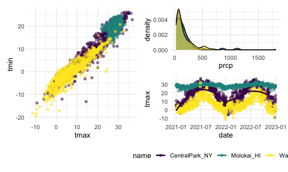

Visualization part 2
================
Shihui Peng
2023-10-12

``` r
library(tidyverse)

knitr::opts_chunk$set(
  fig.width = 6,
  fig.asp = .6,
  out.width = "90%"
)
```

# Get the data for plotting

``` r
weather_df = 
  rnoaa::meteo_pull_monitors(
    c("USW00094728", "USW00022534", "USS0023B17S"),
    var = c("PRCP", "TMIN", "TMAX"), 
    date_min = "2021-01-01",
    date_max = "2022-12-31") |>
  mutate(
    name = recode(
      id, 
      USW00094728 = "CentralPark_NY", 
      USW00022534 = "Molokai_HI",
      USS0023B17S = "Waterhole_WA"),
    tmin = tmin / 10,
    tmax = tmax / 10) |>
  select(name, id, everything())
```

    ## using cached file: /Users/peng_/Library/Caches/org.R-project.R/R/rnoaa/noaa_ghcnd/USW00094728.dly

    ## date created (size, mb): 2023-10-12 05:40:09.606797 (8.534)

    ## file min/max dates: 1869-01-01 / 2023-10-31

    ## using cached file: /Users/peng_/Library/Caches/org.R-project.R/R/rnoaa/noaa_ghcnd/USW00022534.dly

    ## date created (size, mb): 2023-10-12 05:40:14.620904 (3.839)

    ## file min/max dates: 1949-10-01 / 2023-10-31

    ## using cached file: /Users/peng_/Library/Caches/org.R-project.R/R/rnoaa/noaa_ghcnd/USS0023B17S.dly

    ## date created (size, mb): 2023-10-12 05:40:16.392605 (0.997)

    ## file min/max dates: 1999-09-01 / 2023-10-31

## labeling w `labs()`

``` r
weather_df |> 
  ggplot(aes(x = tmin, y = tmax, color = name)) +
  geom_point(alpha = .5) +
  labs(
    x = "Min daily temp (degree C)",
    y = "Max daily temp (degree C)",
    color = "location",
    title = "temperature plot",
    caption = "Max vx min daily temp in 3 location; data from rnoaa"
  )
```

    ## Warning: Removed 17 rows containing missing values (`geom_point()`).


\* **`labs()`**: label, and can label lots of aesthetics. inside the
`labs()`: \* `x =` & `y =`: label the x and y axis. \* `color =`: we
have a color aeshetics mapped onto the name var, so the name var show up
as the legend of the color bar. now, i want to label color as
‘location’. \* `title=` and `caption=` to define title and caption

## scales

we have basically 1 to 1 mapping of whatever on the aes to whatever var
that are put in. but we might want to do some tramsformation in some
association. we can start from adding diff scales to it to modify the
default mapping bt a var and the aes

``` r
weather_df |> 
  ggplot(aes(x = tmin, y = tmax, color = name)) +
  geom_point(alpha = .5) +
  labs(
    x = "Min daily temp (degree C)",
    y = "Max daily temp (degree C)",
    color = "location",
    title = "temperature plot",
    caption = "Max vx min daily temp in 3 location; data from rnoaa"
  ) +
  scale_x_continuous(
    breaks = c(-15, 0, 15),
    labels= c('-15C', '0C', '15C')
  ) +
  scale_y_continuous(
    position = 'right',
    trans = 'sqrt',
    limit = c(20, 30)
  )
```

    ## Warning in self$trans$transform(x): NaNs produced

    ## Warning: Transformation introduced infinite values in continuous y-axis

    ## Warning: Removed 1227 rows containing missing values (`geom_point()`).


- we can control over the location and specification of tick marks on
  the X or Y axis w **`scale_x_* and scale_y_*`** where \* depends on
  the type of variable mapped to the x and y aesthetics (i.e. continuous
  vs discrete).
  - **`scale_x_continuous()`**:
    - `breaks = c(-15, 0, 15)`: use this to control where things fall on
      the x-axis
    - `labels =` is to modify the labels for each point falls o the
      x-axis.
  - **`scale_y_continuous()`**:
    - `position = 'right'`: move the info of y-axis from left (default)
      to right.
    - `trans = 'sqrt'`: do a square root transformation. we can also do
      this w `mutate` before ggplot, and this can be embedded to further
      down below.
    - `limit = c(20, 30)`: limit the y-axis value wi 20~30. but
      `filter()` might be better, bc w limit=, x-axis here is not
      updated and is still the corresponding range with the previous y
      range.

## colors

``` r
weather_df |> 
  ggplot(aes(x = tmin, y = tmax, color = name)) +
  geom_point(alpha = .5) +
  labs(
    x = "Min daily temp (degree C)",
    y = "Max daily temp (degree C)",
    color = "location",
    title = "temperature plot",
    caption = "Max vx min daily temp in 3 location; data from rnoaa"
  ) +
  viridis::scale_color_viridis(discrete = TRUE)
```

    ## Warning: Removed 17 rows containing missing values (`geom_point()`).


\* we can use `scale_color_hue(h = c(150, 300))` to create our own color
scheme, but it usually does not go well. So use **viridis** package is
better. \* We used `discrete = TRUE` because the color aesthetic is
mapped to a discrete variable. In other cases (for example, when color
mapped to prcp) you can omit this argument to get a continuous color
gradient. The `viridis::scale_fill_viridis()` function is appropriate
for the fill aesthetic used in histograms, density plots, and elsewhere.

## themes

``` r
weather_df |> 
  ggplot(aes(x = tmin, y = tmax, color = name)) +
  geom_point(alpha = .5) +
  labs(
    x = "Min daily temp (degree C)",
    y = "Max daily temp (degree C)",
    color = "location",
    title = "temperature plot",
    caption = "Max vx min daily temp in 3 location; data from rnoaa"
  ) +
  viridis::scale_color_viridis(discrete = TRUE) +
  theme_bw() +
  theme(legend.position = 'bottom')
```

    ## Warning: Removed 17 rows containing missing values (`geom_point()`).


``` r
weather_df |> 
  ggplot(aes(x = tmin, y = tmax, color = name)) +
  geom_point(alpha = .5) +
  labs(
    x = "Min daily temp (degree C)",
    y = "Max daily temp (degree C)",
    color = "location",
    title = "temperature plot",
    caption = "Max vx min daily temp in 3 location; data from rnoaa"
  ) +
  viridis::scale_color_viridis(discrete = TRUE) +
  theme_minimal() +
  theme(legend.position = 'bottom')
```

    ## Warning: Removed 17 rows containing missing values (`geom_point()`).


- 1st query
  - **`theme()`**
  - `legend.position = 'bottom'`: move the legend from right (default)
    to bottom, to save place.
    - `legend.position = "none"`: remove the legend – helpful when
      multiple plots use the same color scheme or when the legend is
      obnoxious for some other reason.
  - by default is `theme_grey`, but w `theme_bw()` we can change the
    grey background into white & change the white lines into black.
  - The ordering of `theme_bw()` and `theme()` matters – theme() changes
    a particular element of the plot’s current “theme”. If you call
    theme to change the some element and then theme_bw(), the changes
    introduced by theme() are overwritten by theme_bw().
- 2nd query
  - `theme_minimal()`: is theme_bw but w/o the box around the outside
- `theme_classic()`: no inside lines, and have outside lines on the
  bottom and the left of the plot.

## setting options

``` r
library(tidyverse)

knitr::opts_chunk$set(
  fig.width = 6,
  fig.asp = .6,
  out.width = "90%"
)

theme_set(theme_minimal() + theme(legend.position = "bottom"))

options(
  ggplot2.continuous.colour = "viridis",
  ggplot2.continuous.fill = "viridis"
)

scale_colour_discrete = scale_colour_viridis_d
scale_fill_discrete = scale_fill_viridis_d
```

- use these in the 1st code trunk for every rmd to format all of the
  plots in a rmd. you can adjust if you want to.

## data argument

``` r
weather_df |> 
  ggplot(aes(x = date, y = tmax)) +
  geom_point(aes(color = name)) +
  geom_smooth()
```

    ## `geom_smooth()` using method = 'gam' and formula = 'y ~ s(x, bs = "cs")'

    ## Warning: Removed 17 rows containing non-finite values (`stat_smooth()`).

    ## Warning: Removed 17 rows containing missing values (`geom_point()`).


- where an aesthetic gets mapped to a variable matters
  - here, colored by name only applied to the scatterplot but not the
    smooth lines. if it locates into ggplot(), then this aes will define
    the whole bg, so both scatterplot and smooth lines would be applied
    to it.

## overlay data summaries on a plot of the complete data

``` r
nyc_weather_df =
  weather_df |> 
  filter(name == "CentralPark_NY")

hawaii_weather_df = 
  weather_df |> 
  filter(name == "Molokai_HI")

ggplot(nyc_weather_df, aes(x = date, y = tmax, color = name)) +
  geom_point() +
  geom_line(data = hawaii_weather_df)
```


\* we can have 1 df in 1 geometry and a diff df in a diff geometry \*
here, i add in hawaii ds as a completely separate ds sitting on top of
the ggplot that i make from the beginning.

## patchwork

We can create the “same plot” for several levels of a categorical
variable. But what to do if i need to make plots that are fundamentally
diff in diff panels that i have? eg. juxtapose a scatterplot and a
boxplot, or show scatterplots illustrating relationships between
different variables.

- step 0: loading the patchwork package at the beginning
- step 1: create each of the panels you want separately
- step 2: combine panels using tools in the patchwork package:

``` r
library(patchwork)
```

``` r
tmax_tmin_p = 
  weather_df |> 
  ggplot(aes(x = tmax, y = tmin, color = name)) + 
  geom_point(alpha = .5) +
  theme(legend.position = "none")

prcp_dens_p = 
  weather_df |> 
  filter(prcp > 25) |> 
  ggplot(aes(x = prcp, fill = name)) + 
  geom_density(alpha = .5) + 
  theme(legend.position = "none")

tmax_date_p = 
  weather_df |> 
  ggplot(aes(x = date, y = tmax, color = name)) + 
  geom_point(alpha = .5) +
  geom_smooth(se = FALSE) + 
  theme(legend.position = "bottom")

tmax_tmin_p + prcp_dens_p
```

    ## Warning: Removed 17 rows containing missing values (`geom_point()`).


``` r
tmax_tmin_p + prcp_dens_p / tmax_date_p
```

    ## Warning: Removed 17 rows containing missing values (`geom_point()`).

    ## `geom_smooth()` using method = 'loess' and formula = 'y ~ x'

    ## Warning: Removed 17 rows containing non-finite values (`stat_smooth()`).
    ## Removed 17 rows containing missing values (`geom_point()`).



``` r
(tmax_tmin_p + prcp_dens_p) / tmax_date_p
```

    ## Warning: Removed 17 rows containing missing values (`geom_point()`).

    ## `geom_smooth()` using method = 'loess' and formula = 'y ~ x'

    ## Warning: Removed 17 rows containing non-finite values (`stat_smooth()`).
    ## Removed 17 rows containing missing values (`geom_point()`).


\* **`tmax_tmin_p + prcp_dens_p`**: put these 2 plots together. \*
**`tmax_tmin_p + prcp_dens_p / tmax_date_p`**: `put tmax_date_p` below
`prcp_dens_p`, and then put them and `tmax_tmin_p` together. \*
**`(tmax_tmin_p + prcp_dens_p) / tmax_date_p`**: put `tmax_tmin_p` and
`prcp_dens_p` together, and then put `tmax_date_p` below them.

## data manipultaion

Factor variables are as categorical var that have an **order**.

``` r
weather_df |> 
  mutate(
    name = fct_relevel(name, c("Molokai_HI", "CentralPark_NY", "Waterhole_WA"))
  ) |> 
  ggplot(aes(x = name, y = tmax)) +
  geom_boxplot()
```

    ## Warning: Removed 17 rows containing non-finite values (`stat_boxplot()`).


``` r
weather_df |> 
  mutate(
    name = fct_reorder(name, tmax)
  ) |> 
  ggplot(aes(x = name, y = tmax, color = name)) +
  geom_violin()
```

    ## Warning: There was 1 warning in `mutate()`.
    ## ℹ In argument: `name = fct_reorder(name, tmax)`.
    ## Caused by warning:
    ## ! `fct_reorder()` removing 17 missing values.
    ## ℹ Use `.na_rm = TRUE` to silence this message.
    ## ℹ Use `.na_rm = FALSE` to preserve NAs.

    ## Warning: Removed 17 rows containing non-finite values (`stat_ydensity()`).


- **`fct_relevel()`**: r will regard character var as factor var and
  order them alphabetically (though it still shows in chr type). so we
  use `fct_relevel()` when we want to relevel the factor level in the
  way we like. but we need to do the typing manually.
- **`fct_reorder()`**: If we want to put name in the order according to
  some variables in our ds (eg. here i put name in order according to
  tmax var. r will compute the mean tmax for each group, and make the
  1st factor the one w lowest mean tmax). if we have lots of factors,
  use `fct_reorder()` is better as we dont need to type all factors bu
  hand.
  - we can do this before creating plots. no need to create a new factor
    var unless necessary.

## complicate FAS plot

### example 1

``` r
litters_df =
  read_csv("data/FAS_litters.csv") |> 
  janitor::clean_names() |> 
  separate(group, into = c('dose', 'day_of_tx'), sep = 3)
```

    ## Rows: 49 Columns: 8
    ## ── Column specification ────────────────────────────────────────────────────────
    ## Delimiter: ","
    ## chr (2): Group, Litter Number
    ## dbl (6): GD0 weight, GD18 weight, GD of Birth, Pups born alive, Pups dead @ ...
    ## 
    ## ℹ Use `spec()` to retrieve the full column specification for this data.
    ## ℹ Specify the column types or set `show_col_types = FALSE` to quiet this message.

``` r
pup_data = 
  read_csv("./data/FAS_pups.csv") |>
  janitor::clean_names() |>
  mutate(
    sex = 
      case_match(
        sex, 
        1 ~ "male", 
        2 ~ "female"))
```

    ## Rows: 313 Columns: 6
    ## ── Column specification ────────────────────────────────────────────────────────
    ## Delimiter: ","
    ## chr (1): Litter Number
    ## dbl (5): Sex, PD ears, PD eyes, PD pivot, PD walk
    ## 
    ## ℹ Use `spec()` to retrieve the full column specification for this data.
    ## ℹ Specify the column types or set `show_col_types = FALSE` to quiet this message.

``` r
fas_df =
  left_join(pup_data, litters_df, by = 'litter_number')

fas_df |> 
  select(pd_ears:pd_walk, day_of_tx, dose) |> 
  pivot_longer(
    pd_ears:pd_walk,
    names_to = 'outcome',
    values_to = 'pn_day'
  ) |> 
  drop_na() |> 
  mutate(
    outcome = fct_reorder(outcome, pn_day)
  ) |> 
  ggplot(aes(x = dose, y = pn_day)) +
  geom_violin() + 
  facet_grid(day_of_tx ~ outcome)
```


\* `separate(group, into = c('dose', 'day_of_tx'), sep = 3)`: separate
group var into ‘dose’ and ‘day_of_tx’. `sep = 3` means separate at the
3rd character. \* we can use either `pd_ears:pd_walk` or
`starts_with('pd')` as these 4 cols we want all have same prefix of ‘pd’

### example 2

A more difficult situation relates to data tidiness. Suppose I wanted to
create a three-panel plot showing densities for tmax and tmin within
each location. More concretely, I want to be able to facet panels across
the name variable, and create separate densities for tmax and tmin in
each panel. Unfortunately, weather_df isn’t organized in a way that
makes this easy.

One solution would recognize that tmax and tmin are separate observation
types of a shared temperature variable. With this understanding, it’s
possible to tidy the weather_df (using `pivot_longer`) and make the plot
directly:

``` r
weather_df |>
  select(name, tmax, tmin) |> 
  pivot_longer(
    tmax:tmin,
    names_to = "observation", 
    values_to = "temp") |> 
  ggplot(aes(x = temp, fill = observation)) +
  geom_density(alpha = .5) + 
  facet_grid(~name) + 
  viridis::scale_fill_viridis(discrete = TRUE)
```

    ## Warning: Removed 34 rows containing non-finite values (`stat_density()`).


### example 3

Our emphasis on data tidiness in previous examples is helpful in
visualization. The code below imports and tidies the PULSE data, and
creates a plot showing BDI score across visits. Some steps that are
helpful in retrospect are using `pivot_longer` to organize the BDI score
and visit time variables, and *organizing the visit time variable into a
factor with an informative ordering*.

``` r
pulse_data = 
  haven::read_sas("data/public_pulse_data.sas7bdat") |>
  janitor::clean_names() |>
  pivot_longer(
    bdi_score_bl:bdi_score_12m,
    names_to = "visit", 
    names_prefix = "bdi_score_",
    values_to = "bdi") |>
  select(id, visit, everything()) |>
  mutate(
    visit = recode(visit, "bl" = "00m"),
    visit = factor(visit, levels = str_c(c("00", "01", "06", "12"), "m"))) |>
  arrange(id, visit)

ggplot(pulse_data, aes(x = visit, y = bdi)) + 
  geom_boxplot()
```

    ## Warning: Removed 879 rows containing non-finite values (`stat_boxplot()`).


- can also use
  `visit = fct_relevel(visit, c('00m', '01m', '06m', '12m'))` here
  instead of
  `visit = factor(visit, levels = str_c(c("00", "01", "06", "12"), "m"))`
